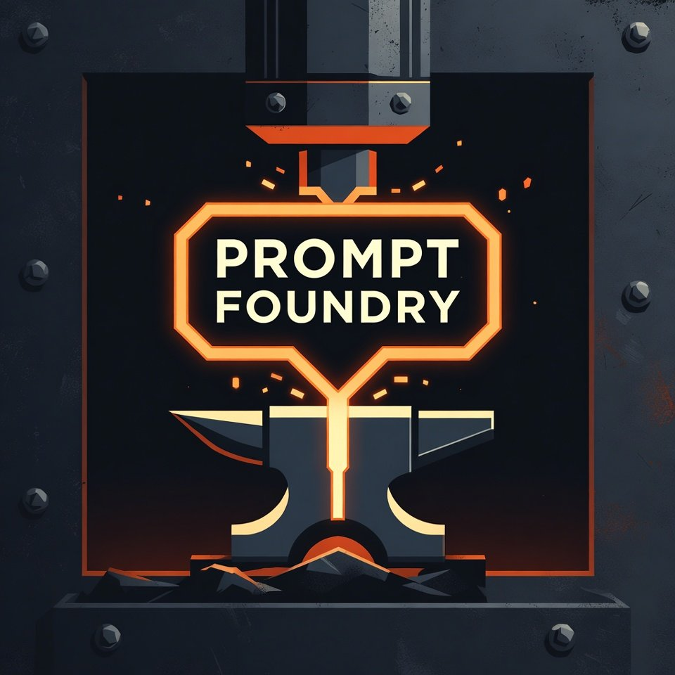

# Prompt Lab v1.6.0 Notes

- Version history is now visible in the app UI, with inline diffs and change notes on save.
- Ghost Variables ship in the prompt flow, including auto-fill helpers for date, time, and clipboard.
- Golden Response benchmarking is live, with pin-and-compare workflow for iteration quality checks.
- The scratchpad is now a real working surface: multi-pad tabs, export, keyboard shortcuts, and save-state feedback.
- Distribution assets are in place: landing updates, setup flow, staged launch copy, and a public hosted demo path.

**Screenshot**

**Demo**

- Hosted demo: https://prompt-lab-tawny.vercel.app/app/
